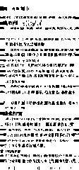

# page_dewarp

This function is modified from https://github.com/mzucker/page_dewarp

Page dewarping and thresholding using a "cubic sheet" model - see full writeup at https://mzucker.github.io/2016/08/15/page-dewarping.html

## How to use

you can test it by running `python page_dewarp.py`

requirements:

- scipy

- opencv-python

## TODO

- [ ] use `numba` to speed up

- [ ] use Text-ZOOM to super-resolution

see demo below 

  --->  

in order to ensure that the text information does not lose a large amount, we need to adjust the algorithm
